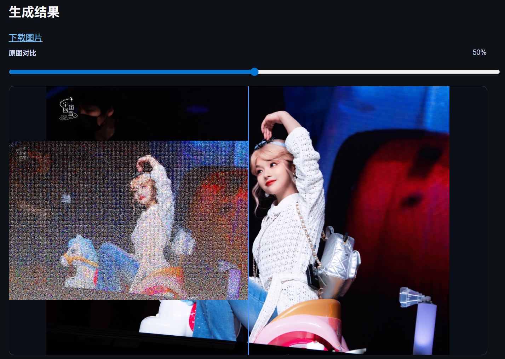
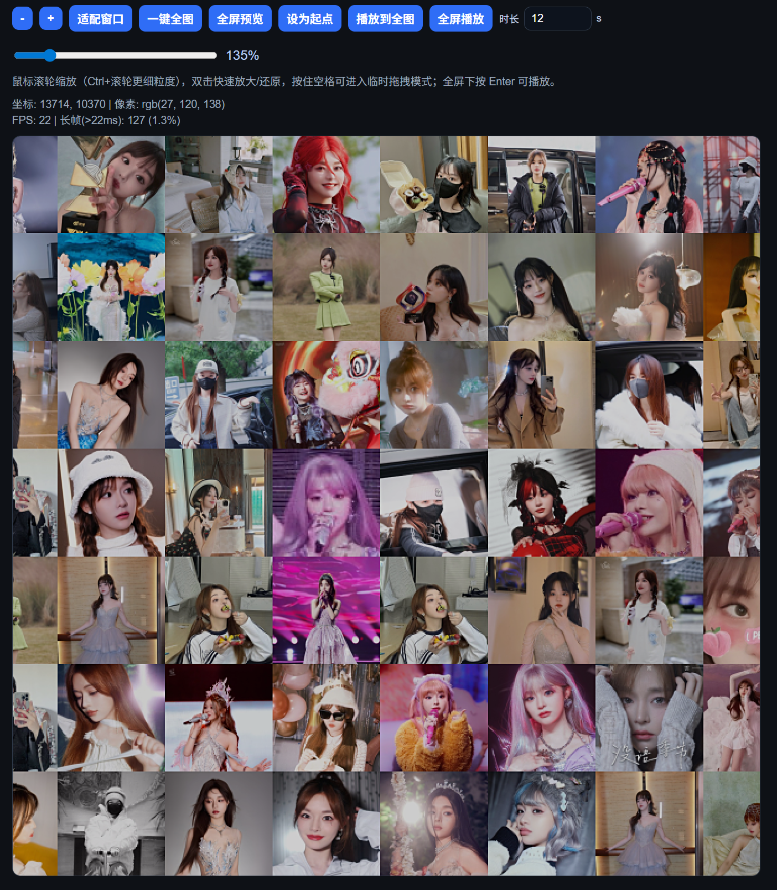

# Ghost Image

Ghost Image is a local Python toolkit for Weibo image collection, portrait-oriented dataset processing, and photo mosaic generation (CLI + Web).

Language docs:
- English: `README.md`
- Chinese: `README.zh-CN.md`

## Demo
Video:
- [Watch demo video](assets/demo.mp4)

Screenshots:



## Features
- Connect to an existing logged-in browser session via CDP.
- Human-like scroll rhythm and low-intensity request pacing.
- Download images into `images/YYYY-MM/` by publish month.
- Persist metadata to `images/metadata.jsonl`:
  - weibo text
  - publish time
  - post URL
  - image URL
  - local file path
- Repair metadata/file consistency after interrupted runs.
- Run portrait filtering and centered crop export to `datasets/...`.
- Generate photo mosaics via both local CLI and local Web UI.

## Project layout
- `src/main.py` - CLI entrypoint
- `src/mosaic_cli.py` - local photo mosaic CLI (main image path + tiles folder)
- `src/mosaic_web.py` - local web app for photo mosaic generation
- `src/mosaic_web/templates/` - web UI templates
- `src/mosaic_web/static/` - web UI static assets
- `src/weibo_album_crawler/` - crawler modules
- `docs/specs/ghost-image/` - OpenSpec docs

## 1) Prepare browser (logged in)
Use Chrome/Edge with remote debugging enabled.

Example A (Chrome on Windows):

```powershell
& "C:\Program Files\Google\Chrome\Application\chrome.exe" --remote-debugging-port=9222 --user-data-dir="C:\temp\chrome-cdp"
```

Example B (Edge on Windows):

```powershell
msedge.exe --remote-debugging-port=9222 --user-data-dir="C:\temp\edge-cdp"
```

Then manually log in to Weibo in that browser window.

Optional check: open `http://127.0.0.1:9222/json/version` in browser.
If you see JSON output, CDP is ready.

## 2) Create virtual environment
```powershell
python -m venv .venv
.\.venv\Scripts\Activate.ps1
pip install -r requirements.txt
python -m playwright install chromium
```

## 3) Run
Dry run (metadata only):

```powershell
python src/main.py --dry-run --max-items 50
```

Download mode:

```powershell
python src/main.py
```

`python src/main.py` is now the default full-mode entry:
- starts from profile feed URL `https://weibo.com/u/1000000000`
- uses API-first hydration (`ajax/statuses/show`) for post text, publish time, and full image list
- discovers + writes metadata immediately, then schedules concurrent downloads in parallel
- keeps DOM extraction only as fallback (without default detail-page backfill step for faster full crawl)

Desensitization note:
- `1000000000` / `1000000001` and `demo_blogger` are anonymized placeholders for documentation and commit safety.
- Replace them with your real profile URL (for example `https://weibo.com/u/<your_blogger_id>`) or pass `--blogger-id <your_blogger_id>` directly.

If you started browser with a different CDP port, set it explicitly:

```powershell
python src/main.py --cdp-url http://127.0.0.1:9333 --max-rounds 150
```

Common options:
- `--cdp-url` default `http://127.0.0.1:9222`
- `--album-url` default target account profile feed (`https://weibo.com/u/1000000000`)
- `--blogger-id` explicit target blogger numeric ID (optional if extractable from `--album-url`)
- `--blogger-name` metadata display name (default `demo_blogger`)
- `--dry-run` metadata-only mode (no file downloads)
- `--max-items` for sample runs
- `--max-rounds` default `150` for full crawl
- `--download-concurrency` default `3` for parallel downloads
- `--image-quality` default `large`, supports `large`, `orj1080`, `orj360`, `mw690` (and other `orj*` / `mw*` tokens)
- `--stagnation-rounds` stop after repeated no-new-content rounds
- `--images-dir` image output root (default `images`)
- `--log-file` custom log path (default: `images/crawl.log`)

Quick quality compare test (same account, 5 images per quality, metadata in-memory only):

```powershell
python test/test_weibo_image_quality.py --album-url https://weibo.com/u/1000000001 --max-items 5 --qualities "large,mw690,orj360,orj1080"
```

Options for `test/test_weibo_image_quality.py`:
- `--cdp-url` default `http://127.0.0.1:9222`
- `--album-url` default `https://weibo.com/u/1000000001`
- `--blogger-id` explicit numeric ID (optional if extractable from `--album-url`)
- `--blogger-name` default `quality-test`
- `--max-items` number of image URLs to collect per quality (default `5`)
- `--qualities` comma-separated tokens, default `"large,mw690,orj360,orj1080"`

## 4) Download and cleanup workflow

This section summarizes the recommended scripts and command lines for
downloading images and cleaning metadata/files safely.

### 4.1 Full download crawl (`src/main.py`)

Use this as the primary entrypoint for discovery + download:

```powershell
python src/main.py --album-url https://weibo.com/u/1000000000 --blogger-name "demo_blogger"
```

Useful variants:

```powershell
# sample run
python src/main.py --max-items 50

# metadata only (no file download)
python src/main.py --dry-run --max-items 50

# custom output directory
python src/main.py --images-dir images --log-file images/crawl.log
```

Output:
- image files: `images/YYYY-MM/*.jpg`
- metadata: `images/metadata.jsonl`
- logs: `images/crawl.log` (or custom `--log-file`)

### 4.2 Repair missing files + purge `skipped_existing` (`src/repair_metadata.py`)

Use this when metadata/file state may be out of sync, or after interrupted runs.
It will:
- re-download rows whose `local_path` file is missing
- update row status/error fields
- backup `metadata.jsonl`
- remove rows with status `skipped_existing`

```powershell
python src/repair_metadata.py --metadata images/metadata.jsonl --images-dir images
```

Useful options:
- `--backup-dir` default `images/backups`
- `--log-file` default `images/repair_metadata.log`
- `--request-timeout` default `35.0`

### 4.3 Consistency check

Quick check that metadata and downloaded files are aligned:

```powershell
python -c "import json; from pathlib import Path; m=Path(r'd:\projects\ghost-image\images\metadata.jsonl'); t=d=e=0; [ (lambda x: (globals().update(t=t+1), globals().update(d=d+1) if str(x.get('status') or '')=='downloaded' else None, globals().update(e=e+1) if str(x.get('status') or '')=='downloaded' and str(x.get('local_path') or '') and Path(str(x.get('local_path'))).exists() else None))(json.loads(s)) for s in m.read_text(encoding='utf-8').splitlines() if s.strip() ]; print('metadata_total=',t); print('downloaded_rows=',d); print('downloaded_files_exist=',e)"
```

If `downloaded_rows != downloaded_files_exist`, metadata contains stale rows or
missing files.

## 5) Portrait filter + centered square crops

This offline step reads `images/metadata.jsonl`, keeps only records with local downloaded files, then:
- detects `person` first (supports full-body and back-view photos)
- falls back to face detection only if no person is found
- performs centered square crop and exports `300x300` jpg files
- for single-person crops: face-visible photos use face-guided framing (`face_guided_100_s100` style), back-view/no-face photos use upperbody-guided framing (`upperbody_hint_s105` style)

Output is written per run into:
- `datasets/<process_code>_<yyyyMMddHHmm>/images/`
- `datasets/<process_code>_<yyyyMMddHHmm>/results.jsonl`

Install deps first (already covered by `pip install -r requirements.txt`), then run:

```powershell
python src/portrait_filter_crop.py --metadata images/metadata.jsonl --process-code demo --sample-size 20 --device 0 --batch-size 16
```

Useful options:
- `--metadata` input metadata jsonl path (default `images/metadata.jsonl`)
- `--process-code` run code used in output directory name (required)
- `--datasets-root` output root directory (default `datasets`)
- `--sample-size` number of images to process (default `20`)
- `--sample-mode first|random` choose deterministic first N or random sampling
- `--seed` random seed for random sample mode (default `42`)
- `--device` YOLO device (e.g. `0`, `1`, `cpu`)
- `--batch-size` YOLO batch size (default `16`)
- `--yolo-imgsz` YOLO inference size (default `960`)
- `--person-conf-thres` confidence threshold for person detector
- `--face-conf-thres` Haar face detector scale factor (default `1.1`)
- `--face-detector-backend auto|yunet|haar` choose face detector backend (`auto` prefers YuNet)
- `--yunet-model-path` path to YuNet ONNX model (auto-download attempted when missing)
- `--yunet-score-thres` YuNet score threshold (default `0.6`)
- `--out-size` output image size in pixels (default `300`)
- `--person-scale` single-person crop scale when face is not detected (default `1.05`)
- `--face-scale` face bbox crop scale (default `1.8`)
- `--person-upperbody-ratio` fallback center ratio for no-face person crops (default `0.22`)
- `--target-face-image` reference identity image path (default `avator.jpg`)
- `--face-identity-backend simple|sface` identity matcher backend (`sface` is recommended for better accuracy)
- `--sface-model-path` path to SFace ONNX model (auto-download attempted when missing)
- `--face-match-thres` keep-image threshold (typical `simple=0.45`, `sface=0.15`; default `0.15`)
- `--face-embedding-size` face vector side length for `simple` backend (default `32`)
- `--face-min-neighbors` robustness for face fallback detector
- `--center-tolerance` max allowed normalized center offset
- `--write-workers` parallel image write workers (default `8`)

## 6) Photo Mosaic local CLI (recommended for quick testing)

Use local file paths directly (no web upload step). This is the fastest way to iterate on quality/performance:

```powershell
.\.venv\Scripts\Activate.ps1
pip install -r requirements.txt
python src/mosaic_cli.py `
  --main-image "d:\projects\ghost-image\datasets\run20_final_strategy_202604222316\images\20260421_150140_64bc9a53a1__person.jpg" `
  --tiles-dir "d:\projects\ghost-image\datasets\run20_final_strategy_202604222316\images" `
  --output "d:\projects\ghost-image\datasets\mosaic_cli\result.jpg" `
  --grid-cols 80 `
  --tile-size 20 `
  --overlay-percent 20
```

Useful options:
- `--recursive` include tile images from nested folders
- `--max-tiles 300` limit tile count for fast iterations
- `--grid-cols` default `80`, valid range `20-200` (larger = more detail, slower)
- `--tile-size` default `20`, valid range `8-80` (larger = bigger output image)
- `--overlay-percent` default `20`, valid range `0-80` (higher = clearer main subject)
- `--diversity-strength` default `0.03`, valid range `0-0.3` (higher = more unique tiles used)
- `--max-reuse` default `3`, valid range `0-1000` (`0` means unlimited tile reuse)
- `--sharpen-amount` default `0.35`, valid range `0-2` (higher = sharper, too high may produce halos)

Output:
- mosaic image at `--output` path

For large tile libraries (for example 7000+ images), recommended baseline:

```powershell
python src/mosaic_cli.py `
  --main-image "path\to\main.jpg" `
  --tiles-dir "datasets\full_202604222337\images" `
  --output "datasets\mosaic_cli\result_best.jpg" `
  --grid-cols 180 `
  --tile-size 24 `
  --overlay-percent 8 `
  --diversity-strength 0.05 `
  --max-reuse 3 `
  --sharpen-amount 0.45
```

Tuning guidance:
- if still only a small subset of tiles is used, increase `--diversity-strength` to `0.06-0.10`
- if colors start looking less accurate, reduce `--diversity-strength` to `0.02-0.05`
- if output still looks soft, reduce `--overlay-percent` to `5-10` and raise `--sharpen-amount` to `0.4-0.7`
- if details are insufficient, increase `--grid-cols` first, then `--tile-size`

## 7) Shared mosaic core (CLI + Web)

Both CLI and Web use the same core functions from `src/mosaic_cli.py`:
- `build_mosaic(...)` for tile matching and rendering
- `normalize_mosaic_params(...)` for shared parameter clamping

This keeps behavior consistent between local script tests and browser usage.

## 8) Photo Mosaic web app (optional)

This project now includes a local web app to create photo mosaics (main photo + tile photo folder):

```powershell
.\.venv\Scripts\Activate.ps1
pip install -r requirements.txt
python src/mosaic_web.py
```

Open [http://127.0.0.1:5000](http://127.0.0.1:5000), then:
- upload 1 main photo
- for local debugging, prefer filling local tile directory path (for example `datasets/full_202604222337/images`) to avoid large upload `413`
- if local tile directory path is empty, select a folder containing many small photos
- tune `grid_cols`, `tile_size`, and `overlay_percent` (same parameter ranges as CLI)
- click **Generate**

Generated images are saved in `datasets/mosaic_web_outputs/`.

`src/mosaic_web.py` currently has no extra CLI flags (start directly with `python src/mosaic_web.py`).

## Safety notes
- The script performs read + scroll + image download only.
- No follow/like/comment actions are executed.
- Keep download intensity low; avoid running multiple crawler instances.

